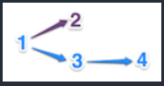
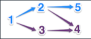
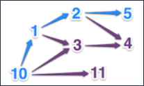
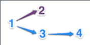
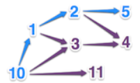

# Dwarfs standing on the shoulders of giants

[Codin Game - Dwarfs standing on the shoulders of giants](https://www.codingame.com/training/medium/dwarfs-standing-on-the-shoulders-of-giants)

## Goal

The saying "_Dwarfs standing on the shoulders of giants_" refers to the importance of being able to build upon the work of our predecessors.

When we read texts, we often only get a small glance of this dependence: this person influenced that person. Thereafter, we learn that the second person, in turn influenced a third and so on. In this exercise we’re interested in the chain of influence and more precisely in finding the longest possible chain.​

## Rules

We choose to represent each person by a distinct integer. If person __#1__ has influenced persons __#2__ and __#3__ and person __#3__ has influenced __#4__ then there is a succession of thoughts between __#1__, __#3__ and __#4__. In this case, it’s the longest succession and the expected result will be 3, since it involves 3 people.



If we were to complete this example when we learn that person __#2__ also influenced persons __#4__ and __#5__, then the longest succession will still have a length of 3, but there will now be several of them.



If we now add that person __#10__ influenced person __#11__, the result remains 3. However, as soon as we learn that __#10__ also influenced __#1__ and __#3__, then the result becomes 4, since there is now a succession involving 4 people, which is __#10__, __#1__, __#2__, __#5__.



Note: It takes time for a thought to influence others. So, we will suppose that it is not possible to have a mutual influence between people, i.e. If __A__ influences __B__ (even indirectly through other people), then __B__ will not influence __A__ (even indirectly). Also, you can not influence yourself.

## Game Input

### Input

Line 1: The number `N` of relationships of influence.

`N` following lines: a relationship of influence between two people in the form of `X` (whitespace) `Y`, which indicates that `X` influences `Y`. The relationships of influence are listed in any order.

### Output

The number of people involved in the longest succession of influences.

### Constraints

0 < `N` < 10000  
0 < `X`, `Y` < 10000

### Examples

#### Example 1 - Input

```text
3
1 2
1 3
3 4
```

#### Example 1 - Output

`3`



#### Example 2 - Input

```text
8
1 2
1 3
3 4
2 4
2 5
10 11
10 1
10 3
```

#### Example 2 - Output

`4`


